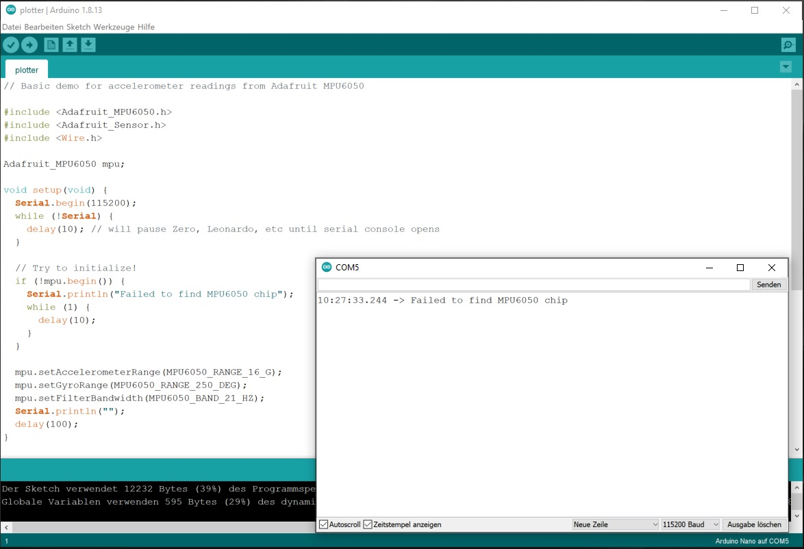

# FitBitTracker - Programming Technical Applications 2021

This repo's content is about a hardware wiring and C++ programming project at Technical University of Applied Sciences Rosenheim. The files are meant to be exchanged with other students for support with the FitBitTracker project.


## Built with

* VS Code
* PlattformIo 
* Arduino IDE


## Bugs and fixes


### Display flicker bug

A bug can occur with wiring the display and showing the ASCII art as output. The display then flickers. These ASCII versions can be used to fix the bug:

**spo2Symbol from Spo2MAX30102Adapter.cpp:**

```c++
static unsigned char spo2Symbol[] = {
    B11100000, B00000000, B00000000, B00000111,
    B10000000, B00000000, B00000000, B00000001,
    B10000000, B00000000, B00000000, B00000001,
    B00000000, B00000000, B00000000, B00000000,
    B00000000, B00000000, B00000000, B00000000,
    B00000000, B00000000, B00000000, B00000000,
    B00000000, B00001111, B11110000, B00000000,
    B00000000, B11110000, B00001111, B00000000,
    B00000001, B11000000, B00000011, B10000000,
    B00000011, B10000000, B00000001, B11000000,
    B00000110, B00000000, B00000000, B01100000,
    B00000110, B00000000, B00000000, B01100000,
    B00001100, B00000000, B00000000, B00110000,
    B00001100, B00000000, B00000000, B00110000,
    B00001100, B00000000, B00000000, B00110000,
    B00000110, B00000000, B00000000, B01100000,
    B00000011, B10000000, B00000001, B11000000,
    B00000001, B11000000, B00000011, B10000000,
    B00000000, B11110000, B00001111, B00000000,
    B00000000, B00001111, B11110000, B00000000,
    B00000000, B00000000, B00000000, B00000000,
    B00000000, B00000000, B00001111, B00000000,
    B00000000, B00000000, B00010000, B10000000,
    B00000000, B00000000, B00010000, B01000000,
    B00000000, B00000000, B00000000, B10000000,
    B00000000, B00000000, B00000001, B00000000,
    B00000000, B00000000, B00000010, B00000000,
    B00000000, B00000000, B00000100, B00000000,
    B00000000, B00000000, B00001000, B00000000,
    B10000000, B00000000, B00011111, B11000001,
    B10000000, B00000000, B00000000, B00000001,
    B11100000, B00000000, B00000000, B00000111};
```

**heart from BpmMAX30102Adapter.cpp:**

```c++
static unsigned char heart[] = {
	B11100000, B00000000, B00000000, B00000111,
	B10000000, B00000000, B00000000, B00000001,
	B10000000, B00000000, B00000000, B00000001,
	B00000000, B00000000, B00000000, B00000000,
	B00000000, B00000000, B00000000, B00000000,
	B00000000, B00000000, B00000000, B00000000,
	B00000000, B11100000, B00000111, B00000000,
	B00000001, B11110000, B00001111, B10000000,
	B00000011, B11111000, B00011111, B11000000,
	B00000111, B11111100, B00111111, B11100000,
	B00001111, B11111110, B01111111, B11110000,
	B00011111, B11111111, B11111111, B11111000,
	B00011111, B11111111, B11111111, B11111000,
	B00011111, B11111111, B11111111, B11111000,
	B00001111, B11111111, B11111111, B11110000,
	B00000111, B11111111, B11111111, B11100000,
	B00000011, B11111111, B11111111, B11000000,
	B00000001, B11111111, B11111111, B10000000,
	B00000000, B11111111, B11111111, B00000000,
	B00000000, B01111111, B11111110, B00000000,
	B00000000, B00111111, B11111100, B00000000,
	B00000000, B00011111, B11111000, B00000000,
	B00000000, B00001111, B11110000, B00000000,
	B00000000, B00000111, B11100000, B00000000,
	B00000000, B00000011, B11000000, B00000000,
	B00000000, B00000001, B10000000, B00000000,
	B00000000, B00000001, B10000000, B00000000,
	B00000000, B00000000, B00000000, B00000000,
	B00000000, B00000000, B00000000, B00000000,
	B10000000, B00000000, B00000000, B00000001,
	B10000000, B00000000, B00000000, B00000001,
	B11100000, B00000000, B00000000, B00000111};
```


**boot from StepCounterGY87Adapter.cpp:**

```c++
static unsigned char boot[] = {
    B11100000, B00000000, B00000000, B00000111,
    B10000000, B00000000, B00000000, B00000001,
    B10000000, B00000000, B00000000, B00000001,
    B00000000, B00000000, B00000000, B00000000,
    B00000000, B00000000, B00000000, B00000000,
    B00000000, B00000000, B00000000, B00000000,
    B00000000, B00001111, B11111100, B00000000,
    B00000000, B00001111, B11111000, B00000000,
    B00000000, B00011111, B11111000, B00000000,
    B00000000, B00011111, B11110000, B00000000,
    B00000000, B00111111, B11110000, B00000000,
    B00000000, B00111111, B11100000, B00000000,
    B00000000, B01111111, B11100000, B00000000,
    B00000000, B01111111, B11000000, B00000000,
    B00000000, B11111111, B11000000, B00000000,
    B00000000, B11111111, B10000000, B00000000,
    B00000001, B11111111, B10000000, B00000000,
    B00000001, B11111111, B00000000, B00000000,
    B00000000, B11111111, B10000000, B00000000,
    B00000000, B11111111, B11000000, B00000000,
    B00000000, B01111111, B11100000, B00000000,
    B00000000, B00111111, B11110000, B00000000,
    B00000000, B00011111, B11111000, B00000000,
    B00000000, B00001111, B11111100, B00000000,
    B00011111, B11000111, B11111110, B00000000,
    B00000000, B00000011, B11111111, B00000000,
    B00011111, B11110001, B11111111, B10000000,
    B00000000, B00000000, B11111111, B00000000,
    B00011111, B11111100, B01111110, B00000000,
    B10000000, B00000000, B00111100, B00000001,
    B10000000, B00000000, B00000000, B00000001,
    B11100000, B00000000, B00000000, B00000111};
```


### StepCounter Bug

The StepCounter module doesn't work and doesn't get recognized by the Arduino IDE and pre-built sketches as well:




**Wiring:**

```
Nano A4  -> green    -> MPU6050 SDA
Nano A5  -> yellow   -> MPU6050 SCL
Nano 5V  -> red      -> MPU6050 VCC_IN
Nano GND -> black    -> MPU6050 GND
```


LED on MPU6050 glows.
Example sketch doesn't find the chip while initialization.


**Problem solving attempts, without success:**
- change cables to new ones
- change cable slots
- try to init the isolated chip without other modules
- change 3V voltage Nano to 3.3V Pin on the MPU6050

**Conclusion:** the chip is broken 😐


### SPO Bug

The SPO module is too big for the memory chip of the Nano and can't be transmitted. Using another board with more storage would fix this for the next semester.